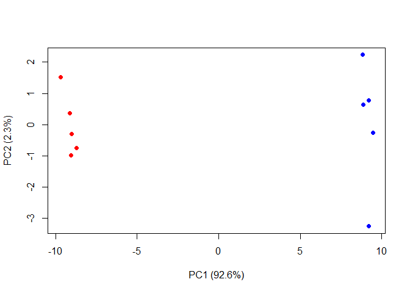

Lab08 Classwork
================
Priya Jindal
10/24/2019

``` r
tmp <- c(rnorm(30,-3), rnorm(30,3))
x <- cbind(x=tmp, y=rev(tmp))
plot(x)
```

<!-- -->

``` r
k <- kmeans(x, centers = 2, nstart = 20)
k
```

    ## K-means clustering with 2 clusters of sizes 30, 30
    ## 
    ## Cluster means:
    ##           x         y
    ## 1  3.085046 -3.352704
    ## 2 -3.352704  3.085046
    ## 
    ## Clustering vector:
    ##  [1] 2 2 2 2 2 2 2 2 2 2 2 2 2 2 2 2 2 2 2 2 2 2 2 2 2 2 2 2 2 2 1 1 1 1 1
    ## [36] 1 1 1 1 1 1 1 1 1 1 1 1 1 1 1 1 1 1 1 1 1 1 1 1 1
    ## 
    ## Within cluster sum of squares by cluster:
    ## [1] 63.23412 63.23412
    ##  (between_SS / total_SS =  90.8 %)
    ## 
    ## Available components:
    ## 
    ## [1] "cluster"      "centers"      "totss"        "withinss"    
    ## [5] "tot.withinss" "betweenss"    "size"         "iter"        
    ## [9] "ifault"

How many points in each cluster? -\> 30 What component is your result
object details -cluster size -\> “K-means clustering with 2 clusters of
sizes 30, 30” k$size -cluster membership -\> clustering vector, which
point is in what cluster -cluster center -\> cluster means vectors

``` r
k$size
```

    ## [1] 30 30

``` r
k$cluster #clustering vector
```

    ##  [1] 2 2 2 2 2 2 2 2 2 2 2 2 2 2 2 2 2 2 2 2 2 2 2 2 2 2 2 2 2 2 1 1 1 1 1
    ## [36] 1 1 1 1 1 1 1 1 1 1 1 1 1 1 1 1 1 1 1 1 1 1 1 1 1

``` r
k$centers
```

    ##           x         y
    ## 1  3.085046 -3.352704
    ## 2 -3.352704  3.085046

``` r
plot(x, col = k$cluster)
points(k$centers, col = "green", pch=15)
```

<!-- -->

``` r
dist_matrix <- dist(x)
hc <- hclust(d=dist_matrix)
plot(hc)
```

<!-- -->

``` r
cutree(hc, k=4)
```

    ##  [1] 1 1 2 2 1 1 1 1 2 1 1 2 1 1 1 1 2 1 1 2 1 1 1 1 2 1 2 2 1 1 3 3 4 4 3
    ## [36] 4 3 3 3 3 4 3 3 4 3 3 3 3 4 3 3 4 3 3 3 3 4 4 3 3

``` r
# Step 1. Generate some example data for clustering
x <- rbind(
 matrix(rnorm(100, mean=0, sd = 0.3), ncol = 2), # c1
 matrix(rnorm(100, mean = 1, sd = 0.3), ncol = 2), # c2
 matrix(c(rnorm(50, mean = 1, sd = 0.3), # c3
 rnorm(50, mean = 0, sd = 0.3)), ncol = 2))
colnames(x) <- c("x", "y")
# Step 2. Plot the data without clustering
plot(x)
```

<!-- -->

``` r
# Step 3. Generate colors for known clusters
# (just so we can compare to hclust results)
col <- as.factor( rep(c("c1","c2","c3"), each=50) )
plot(x, col=col)
```

<!-- -->

``` r
hc <- hclust(dist(x))
plot(hc)
abline(h=2, col="red")
```

<!-- -->

``` r
grps <- cutree(hc, h = 2)
```

``` r
plot(x, col=grps)
```

<!-- -->

``` r
table(grps, col)
```

    ##     col
    ## grps c1 c2 c3
    ##    1 50  3  8
    ##    2  0 47  6
    ##    3  0  0 36

``` r
mydata <- read.csv("https://tinyurl.com/expression-CSV", row.names =1)

head(mydata)
```

    ##        wt1 wt2  wt3  wt4 wt5 ko1 ko2 ko3 ko4 ko5
    ## gene1  439 458  408  429 420  90  88  86  90  93
    ## gene2  219 200  204  210 187 427 423 434 433 426
    ## gene3 1006 989 1030 1017 973 252 237 238 226 210
    ## gene4  783 792  829  856 760 849 856 835 885 894
    ## gene5  181 249  204  244 225 277 305 272 270 279
    ## gene6  460 502  491  491 493 612 594 577 618 638

``` r
#x <- read.csv("data/UK_foods.csv")
```

\#How many genes are in the dataset?

``` r
dim(mydata)
```

    ## [1] 100  10

``` r
nrow(mydata)
```

    ## [1] 100

\#Lets do PCA

``` r
## lets do PCA
pca <- prcomp(t(mydata), scale=TRUE)
## See what is returned by the prcomp() function

## A basic PC1 vs PC2 2-D plot 
plot(pca$x[,1], pca$x[,2]) 
```

<!-- -->

``` r
## Precent variance is often more informative to look at
pca.var <- pca$sdev^2
pca.var.per <- round(pca.var/sum(pca.var)*100, 1) 
pca.var.per
```

    ##  [1] 92.6  2.3  1.1  1.1  0.8  0.7  0.6  0.4  0.4  0.0

``` r
attributes(pca)
```

    ## $names
    ## [1] "sdev"     "rotation" "center"   "scale"    "x"       
    ## 
    ## $class
    ## [1] "prcomp"

``` r
# $names
#[1] "sdev" "rotation" "center" "scale" "x"
#
# $class
#[1] "prcomp"
```

``` r
barplot(pca.var.per, main="Scree Plot",
 xlab="Principal Component", ylab="Percent Variation")
```

<!-- -->

``` r
## A vector of colors for wt and ko samples
colvec <- colnames(mydata)
colvec[grep("wt", colvec)] <- "red"
colvec[grep("ko", colvec)] <- "blue"
plot(pca$x[,1], pca$x[,2], col=colvec, pch=16,
 xlab=paste0("PC1 (", pca.var.per[1], "%)"),
 ylab=paste0("PC2 (", pca.var.per[2], "%)")) 
```

<!-- -->

# Classwork Hands-On Section s

``` r
x <- read.csv("data/UK_foods.csv")
x
```

    ##                      X England Wales Scotland N.Ireland
    ## 1               Cheese     105   103      103        66
    ## 2        Carcass_meat      245   227      242       267
    ## 3          Other_meat      685   803      750       586
    ## 4                 Fish     147   160      122        93
    ## 5       Fats_and_oils      193   235      184       209
    ## 6               Sugars     156   175      147       139
    ## 7      Fresh_potatoes      720   874      566      1033
    ## 8           Fresh_Veg      253   265      171       143
    ## 9           Other_Veg      488   570      418       355
    ## 10 Processed_potatoes      198   203      220       187
    ## 11      Processed_Veg      360   365      337       334
    ## 12        Fresh_fruit     1102  1137      957       674
    ## 13            Cereals     1472  1582     1462      1494
    ## 14           Beverages      57    73       53        47
    ## 15        Soft_drinks     1374  1256     1572      1506
    ## 16   Alcoholic_drinks      375   475      458       135
    ## 17      Confectionery       54    64       62        41

Q1: How many rows/columns are in your new data frame names x

``` r
dim(x)
```

    ## [1] 17  5

Fix the row names set up

``` r
rownames(x) <- x[,1]
x <- x[,-1]
head(x)
```

    ##                England Wales Scotland N.Ireland
    ## Cheese             105   103      103        66
    ## Carcass_meat       245   227      242       267
    ## Other_meat         685   803      750       586
    ## Fish               147   160      122        93
    ## Fats_and_oils      193   235      184       209
    ## Sugars             156   175      147       139

``` r
x <- read.csv("data/UK_foods.csv", row.names=1)
head(x)
```

    ##                England Wales Scotland N.Ireland
    ## Cheese             105   103      103        66
    ## Carcass_meat       245   227      242       267
    ## Other_meat         685   803      750       586
    ## Fish               147   160      122        93
    ## Fats_and_oils      193   235      184       209
    ## Sugars             156   175      147       139

Q2: Which approach to solwing row name problem is better x \<-
read.csv(“data/UK\_foods.csv”, row.names=1)

``` r
barplot(as.matrix(x), beside=T, col=rainbow(nrow(x)))
```

<!-- --> Q3: if we
leave out the optional param beside then we can get the other type of
bar graph

``` r
barplot(as.matrix(x), col=rainbow(nrow(x)))
```

<!-- -->

``` r
pairs(x, col=rainbow(10), pch=16)
```

<!-- --> Q4: If the
points lie in the diagonal that means those 2 countries’s trends are
positvelly correlating.

\#PCA practice

``` r
pca <- prcomp(t(x))
summary(pca)
```

    ## Importance of components:
    ##                             PC1      PC2      PC3       PC4
    ## Standard deviation     324.1502 212.7478 73.87622 4.189e-14
    ## Proportion of Variance   0.6744   0.2905  0.03503 0.000e+00
    ## Cumulative Proportion    0.6744   0.9650  1.00000 1.000e+00

``` r
#Plot Pc1 vs pc2 
plot(pca$x[,1], pca$x[,2], xlab="PC1", ylab="PC2", xlim=c(-270,500))
text(pca$x[,1], pca$x[,2], colnames(x))
```

<!-- -->
