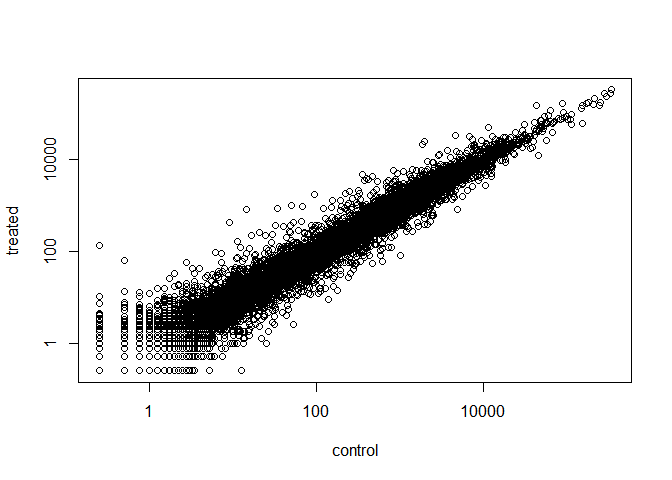

Class 14: Transcriptomics and the analysis of RNA-Seq data
================

## DESeq2 setup

We will use the DESeq2 package from bioconductor. To install run teh
follwing commands.

``` r
install.packages("BiocManager")
BiocManager::install()
BiocManager::install("DESeq2")
```

``` r
counts <- read.csv("airway_scaledcounts.csv", stringsAsFactors = FALSE)
metadata <- read.csv("airway_metadata.csv", stringsAsFactors = FALSE)
```

``` r
head(metadata)
```

    ##           id     dex celltype     geo_id
    ## 1 SRR1039508 control   N61311 GSM1275862
    ## 2 SRR1039509 treated   N61311 GSM1275863
    ## 3 SRR1039512 control  N052611 GSM1275866
    ## 4 SRR1039513 treated  N052611 GSM1275867
    ## 5 SRR1039516 control  N080611 GSM1275870
    ## 6 SRR1039517 treated  N080611 GSM1275871

``` r
head(counts)
```

    ##           ensgene SRR1039508 SRR1039509 SRR1039512 SRR1039513 SRR1039516
    ## 1 ENSG00000000003        723        486        904        445       1170
    ## 2 ENSG00000000005          0          0          0          0          0
    ## 3 ENSG00000000419        467        523        616        371        582
    ## 4 ENSG00000000457        347        258        364        237        318
    ## 5 ENSG00000000460         96         81         73         66        118
    ## 6 ENSG00000000938          0          0          1          0          2
    ##   SRR1039517 SRR1039520 SRR1039521
    ## 1       1097        806        604
    ## 2          0          0          0
    ## 3        781        417        509
    ## 4        447        330        324
    ## 5         94        102         74
    ## 6          0          0          0

How many genes do we have in the dataset?

``` r
#num rows= num genes
nrow(counts)
```

    ## [1] 38694

How many experiemnts do we have in this data?

``` r
#num columns = num experiments 
ncol(counts) -1
```

    ## [1] 8

``` r
#View(metadata)
```

Are the means of the drug treated samples different from the control
samples, given the std. deviation

We want to see if there is a difference in expression values for control
and treated samples.

First we are finding for each control experiment the expression level
mean for each gene (based on the SRR ids = that tells us which sample is
control or treatment)

Then we will repeat the same thing for the the treatment expression
level for each gene.

``` r
control <- metadata[metadata[,"dex"]=="control",]
control.mean <- rowSums(counts[ ,control$id])/4
names(control.mean)<- counts$ensgene
```

``` r
treatment <- metadata[metadata$dex=="treated",]
treatment.mean <- rowSums(counts[ ,treatment$id])/length(treatment$id)
names(treatment.mean)<- counts$ensgene
```

Now we want to plot the control means vs the treated means.

``` r
meancounts <- data.frame(control.mean, treatment.mean)
plot(meancounts$control.mean, meancounts$treatment.mean )
```

<!-- -->

``` r
plot(meancounts$control.mean, meancounts$treatment.mean , log = "xy", xlab = "control", ylab = "treated")
```

    ## Warning in xy.coords(x, y, xlabel, ylabel, log): 15032 x values <= 0
    ## omitted from logarithmic plot

    ## Warning in xy.coords(x, y, xlabel, ylabel, log): 15281 y values <= 0
    ## omitted from logarithmic plot

<!-- -->

We can find candidate differentially expressed genes by looking for
genes with a large change between control and dex-treated samples. We
usually look at the log2 of the fold change, because this has better
mathematical properties.

Here we calculate log2foldchange, add it to our meancounts data.frame

``` r
meancounts$log2fc <- log2(meancounts[,"treatment.mean"]/meancounts[,"control.mean"])
```

``` r
head(meancounts)
```

    ##                 control.mean treatment.mean      log2fc
    ## ENSG00000000003       900.75         658.00 -0.45303916
    ## ENSG00000000005         0.00           0.00         NaN
    ## ENSG00000000419       520.50         546.00  0.06900279
    ## ENSG00000000457       339.75         316.50 -0.10226805
    ## ENSG00000000460        97.25          78.75 -0.30441833
    ## ENSG00000000938         0.75           0.00        -Inf

``` r
#which tells us indices of where the data is equal to 0
zero.vals <- which(meancounts[,1:2]==0, arr.ind=TRUE)

to.rm <- unique(zero.vals[,1])
mycounts <- meancounts[-to.rm,]
head(mycounts)
```

    ##                 control.mean treatment.mean      log2fc
    ## ENSG00000000003       900.75         658.00 -0.45303916
    ## ENSG00000000419       520.50         546.00  0.06900279
    ## ENSG00000000457       339.75         316.50 -0.10226805
    ## ENSG00000000460        97.25          78.75 -0.30441833
    ## ENSG00000000971      5219.00        6687.50  0.35769358
    ## ENSG00000001036      2327.00        1785.75 -0.38194109

A common threshold used for calling something differentially expressed
is a log2(FoldChange) of greater than 2 or less than -2. Let’s filter
the dataset both ways to see how many genes are up or down-regulated.

``` r
up.ind <- mycounts$log2fc > 2
down.ind <- mycounts$log2fc < (-2)
sum(up.ind)
```

    ## [1] 250

``` r
sum(down.ind)
```

    ## [1] 367

# DESeq2 analysis

Let’s do this the right way. DESeq2 is an R package for analyzing
count-based NGS data like RNA-seq. It is available from Bioconductor.
Bioconductor is a project to provide tools for analyzing high-throughput
genomic data including RNA-seq, ChIP-seq and arrays. You can explore
Bioconductor packages here.

Bioconductor packages usually have great documentation in the form of
vignettes. For a great example, take a look at the DESeq2 vignette for
analyzing count data. This 40+ page manual is packed full of examples on
using DESeq2, importing data, fitting models, creating visualizations,
references, etc.

``` r
library(DESeq2)
```

    ## Loading required package: S4Vectors

    ## Loading required package: stats4

    ## Loading required package: BiocGenerics

    ## Loading required package: parallel

    ## 
    ## Attaching package: 'BiocGenerics'

    ## The following objects are masked from 'package:parallel':
    ## 
    ##     clusterApply, clusterApplyLB, clusterCall, clusterEvalQ,
    ##     clusterExport, clusterMap, parApply, parCapply, parLapply,
    ##     parLapplyLB, parRapply, parSapply, parSapplyLB

    ## The following objects are masked from 'package:stats':
    ## 
    ##     IQR, mad, sd, var, xtabs

    ## The following objects are masked from 'package:base':
    ## 
    ##     anyDuplicated, append, as.data.frame, basename, cbind,
    ##     colnames, dirname, do.call, duplicated, eval, evalq, Filter,
    ##     Find, get, grep, grepl, intersect, is.unsorted, lapply, Map,
    ##     mapply, match, mget, order, paste, pmax, pmax.int, pmin,
    ##     pmin.int, Position, rank, rbind, Reduce, rownames, sapply,
    ##     setdiff, sort, table, tapply, union, unique, unsplit, which,
    ##     which.max, which.min

    ## 
    ## Attaching package: 'S4Vectors'

    ## The following object is masked from 'package:base':
    ## 
    ##     expand.grid

    ## Loading required package: IRanges

    ## 
    ## Attaching package: 'IRanges'

    ## The following object is masked from 'package:grDevices':
    ## 
    ##     windows

    ## Loading required package: GenomicRanges

    ## Loading required package: GenomeInfoDb

    ## Loading required package: SummarizedExperiment

    ## Loading required package: Biobase

    ## Welcome to Bioconductor
    ## 
    ##     Vignettes contain introductory material; view with
    ##     'browseVignettes()'. To cite Bioconductor, see
    ##     'citation("Biobase")', and for packages 'citation("pkgname")'.

    ## Loading required package: DelayedArray

    ## Loading required package: matrixStats

    ## 
    ## Attaching package: 'matrixStats'

    ## The following objects are masked from 'package:Biobase':
    ## 
    ##     anyMissing, rowMedians

    ## Loading required package: BiocParallel

    ## 
    ## Attaching package: 'DelayedArray'

    ## The following objects are masked from 'package:matrixStats':
    ## 
    ##     colMaxs, colMins, colRanges, rowMaxs, rowMins, rowRanges

    ## The following objects are masked from 'package:base':
    ## 
    ##     aperm, apply, rowsum

``` r
citation("DESeq2")
```

    ## 
    ##   Love, M.I., Huber, W., Anders, S. Moderated estimation of fold
    ##   change and dispersion for RNA-seq data with DESeq2 Genome
    ##   Biology 15(12):550 (2014)
    ## 
    ## A BibTeX entry for LaTeX users is
    ## 
    ##   @Article{,
    ##     title = {Moderated estimation of fold change and dispersion for RNA-seq data with DESeq2},
    ##     author = {Michael I. Love and Wolfgang Huber and Simon Anders},
    ##     year = {2014},
    ##     journal = {Genome Biology},
    ##     doi = {10.1186/s13059-014-0550-8},
    ##     volume = {15},
    ##     issue = {12},
    ##     pages = {550},
    ##   }

We will use the DESeqDataSetFromMatrix() function to build the required
DESeqDataSet object and call it dds, short for our DESeqDataSet. If you
get a warning about “some variables in design formula are characters,
converting to factors” don’t worry about it. Take a look at the dds
object once you create it.

``` r
dds <- DESeqDataSetFromMatrix(countData=counts, 
                              colData=metadata, 
                              design=~dex, 
                              tidy=TRUE)
```

    ## converting counts to integer mode

    ## Warning in DESeqDataSet(se, design = design, ignoreRank): some variables in
    ## design formula are characters, converting to factors

``` r
dds
```

    ## class: DESeqDataSet 
    ## dim: 38694 8 
    ## metadata(1): version
    ## assays(1): counts
    ## rownames(38694): ENSG00000000003 ENSG00000000005 ...
    ##   ENSG00000283120 ENSG00000283123
    ## rowData names(0):
    ## colnames(8): SRR1039508 SRR1039509 ... SRR1039520 SRR1039521
    ## colData names(4): id dex celltype geo_id

``` r
dds <- DESeq(dds)
```

    ## estimating size factors

    ## estimating dispersions

    ## gene-wise dispersion estimates

    ## mean-dispersion relationship

    ## final dispersion estimates

    ## fitting model and testing

``` r
res <- results(dds)
```

# Data Visualization

Plotting counts DESeq2 offers a function called plotCounts() that takes
a DESeqDataSet that has been run through the pipeline, the name of a
gene, and the name of the variable in the colData that you’re interested
in, and plots those values.

Volcano plots Let’s make another commonly produced visualization from
this data, namely so-called Volcano plots. These summary figures are
frequently used to highlight the proportion of genes that are both
significantly regulated and display a high fold change.

First, let’s add a column called sig to our full res results that
evaluates to TRUE only if padj\<0.05 and the absolute log2FoldChange\>2,
FALSE if not, and NA if padj is also NA.

``` r
res$sig <- res$padj<0.05 & abs(res$log2FoldChange)>2
table(res$sig)
```

    ## 
    ## FALSE  TRUE 
    ## 24282   167

Make the volcano plot using res data

``` r
palette(c("gray", "blue"))

plot(res$log2FoldChange, -log(res$padj), col=res$sig+1, ylab="-Log(P-value)", xlab= "Log2(FoldChange)")

abline(v=c(-2,2), col="darkgray", lty=2)
abline(h=-log(0.1), col="darkgray", lty=2)
```

<!-- -->

``` r
palette("default")

mycols <- rep("gray", nrow(res))

#make points with +2 or -2 fold change red 
mycols[ abs(res$log2FoldChange) > 2 ]  <- "red" 


inds <- (res$padj < 0.01) & (abs(res$log2FoldChange) > 2 )
mycols[ inds ] <- "blue"

#Volcano plot with custom colors 
plot( res$log2FoldChange,  -log(res$padj), 
 col=mycols, ylab="-Log(P-value)", xlab="Log2(FoldChange)" )

abline(v=c(-2,2), col="gray", lty=2)
abline(h=-log(0.1), col="gray", lty=2)
```

<!-- -->

We can do the same thing with ggplot:

``` r
ggplot(as.data.frame(res), aes(log2FoldChange, -log10(pvalue), col=sig)) + 
    geom_point() + 
    ggtitle("Volcano plot")
```

Save the results csv file

``` r
write.csv(res, file="experession_results.csv")
```
