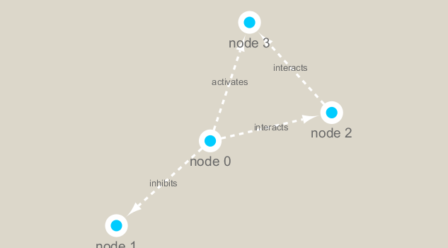

```{r setup, include=FALSE}
knitr::opts_chunk$set(echo = TRUE)
```

```{r}
library(RCy3)
library(igraph)
library(RColorBrewer)

```

```{r}
cytoscapePing()

```

```{r}
# Check the version
cytoscapeVersionInfo()
```

```{r}
g <- makeSimpleIgraph()
createNetworkFromIgraph(g,"myGraph")
```

```{r}
fig <- exportImage(filename="demo", type="png", height=350)
```
```{r}

```

If you turn to your Cytoscape window you should now see an updated stylized network displayed (see below).
```{r}
setVisualStyle("Marquee")

fig <- exportImage(filename="demo_marquee", type="png", height=350)


```

Read our metagenomics data
We will read in a species co-occurrence matrix that was calculated using Spearman Rank coefficient. (see reference Lima-Mendez et al. (2015) for details).

```{r}
# scripts for processing located in "inst/data-raw/"
prok_vir_cor <- read.delim("virus_prok_cor_abundant.tsv", stringsAsFactors = FALSE)

# Have a peak at the first 6 rows
head(prok_vir_cor)
```

Here we will use the igraph package to convert the co-occurrence dataframe into a network that we can send to Cytoscape. In this case our graph is undirected (so we will set directed = FALSE) since we do not have any information about the direction of the interactions from this type of data.

```{r}
g <- graph.data.frame(prok_vir_cor, directed = FALSE)
plot(g)
```
This is a hot-mess! Lets turn off the blue text labels

```{r}
plot(g, vertex.label=NA)

```
The nodes/vertex are too big. Lets make them smaller…

```{r}
plot(g, vertex.size=3, vertex.label=NA)

```


##Network querys
Note that we can query (and set) vertex and edge attributes with the V() and E() functions respectively:
```{r}
V(g)
E(g)
```

##Network community detection

```{r}
cb <- cluster_edge_betweenness(g)

```
```{r}
plot(cb, y=g, vertex.label=NA,  vertex.size=3)

```
```{r}
# Make a size vector btwn 2 and 20 for node plotting size
pr <- page_rank(g)
v.size <- BBmisc::normalize(pr$vector, range=c(2,20), method="range")
plot(g, vertex.size=v.size, vertex.label=NA)
```

