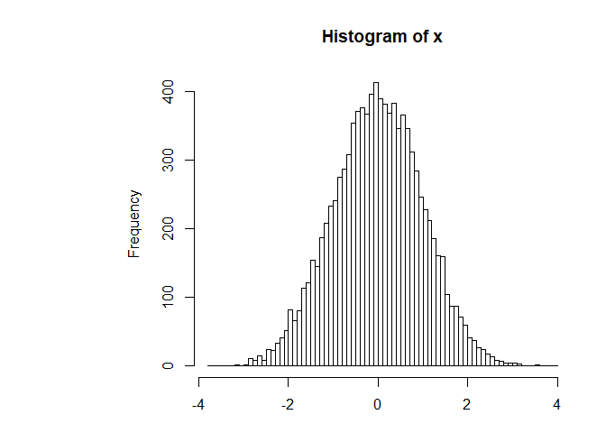

Class 5 R Introduction
================
Priya Jindal
2019-10-31

``` r
# R script for class 5

weight <- read.table("bimm143_05_rstats/weight_chart.txt", header = TRUE)

#line and point plot
plot(weight$Age, weight$Weight, type = "o", pch=15, cex=1.5, lwd=2, ylim=c(2,10),
     xlab="Age(months)", ylab="Weight(kg)", main = "Baby weight with age")
```

<!-- -->

``` r
# barplot
mouse <- read.table("bimm143_05_rstats/feature_counts.txt", sep="\t", header = TRUE)
barplot(mouse$Count)
```

<!-- -->

``` r
par(mar=c(3.2, 11.2, 4.1, 2))
barplot(mouse$Count, names.arg=mouse$Feature, 
        horiz=TRUE, ylab="", 
        main="Number of features in a mouse GRCm38 genome", 
        las=1, xlim=c(0,80000))
```

<!-- -->

``` r
#histograms 
x <- c(rnorm(10000))
hist(x, breaks=80)
```

<!-- -->

``` r
#Colors
#rainbow
mfc <- read.delim("bimm143_05_rstats/male_female_counts.txt")
barplot(mfc$Count, names.arg=mfc$Sample, 
        horiz=FALSE, 
        las=3, ylim=c(0,20), ylab="Counts", col=rainbow(nrow(mfc)) )
```

<!-- -->

``` r
#different colors for males/females 
mfc2 <- read.delim("bimm143_05_rstats/male_female_counts.txt")
barplot(mfc2$Count, names.arg=mfc2$Sample, 
        las=2, ylim=c(0,20), ylab="Counts", col=c("blue1", "red1") )
```

<!-- -->

``` r
#Colors part 3

genes <- read.delim("bimm143_05_rstats/up_down_expression.txt")
table(genes$State)
```

    ## 
    ##       down unchanging         up 
    ##         72       4997        127

``` r
palette(c("blue","pink","green"))
plot(genes$Condition1, genes$Condition2, col=genes$State, xlab="Expression Condition 1", ylab="Expression Condition 2")
```

<!-- -->

``` r
#last problem (fix it) 
```
